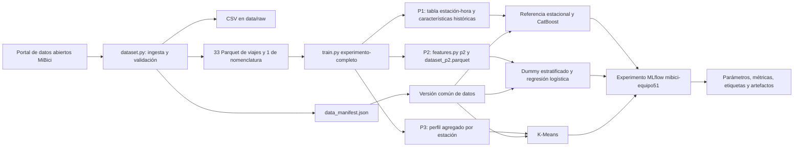

# Arquitectura del Sistema MLOps — Proyecto MiBici (Equipo 51)
---

```mermaid
flowchart LR
    A[Portal de datos abiertos MiBici] --> B[dataset.py: ingesta y validación]
    B --> C[CSV en data/raw]
    B --> D[33 Parquet de viajes y 1 de nomenclatura]
    B --> E[data_manifest.json]
    D --> F[train.py experimento-completo]
    F --> G1[P1: tabla estación-hora y características históricas]
    F --> G2[P2: features.py p2 y dataset_p2.parquet]
    F --> G3[P3: perfil agregado por estación]
    G1 --> H1[Referencia estacional y CatBoost]
    G2 --> H2[Dummy estratificado y regresión logística]
    G3 --> H3[K-Means]
    E --> I[Versión común de datos]
    I --> H1
    I --> H2
    I --> H3
    H1 --> J[Experimento MLflow mibici-equipo51]
    H2 --> J
    H3 --> J
    J --> K[Parámetros, métricas, etiquetas y artefactos]
```

---

